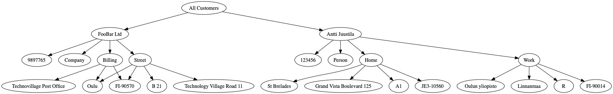

# EntityManipulator demonstration

This project is meant to demonstrate the relationships between UML class diagrams and C++ code.

See the included png file for the class diagram, and study the code to see how the class diagram and code relate to each other. Note that three design patterns have been implemented in the app -- [Composite](https://en.wikipedia.org/wiki/Composite_pattern), [Visitor](https://en.wikipedia.org/wiki/Visitor_pattern) and [Prototype](https://en.wikipedia.org/wiki/Prototype_pattern).


In the `main.cpp` an object structure is created. Then code demonstrates three ways (JSON, XML, GraphViz DOT file) to externalize the object structure into a stream using *marshallers*. The object structure looks like this:

```
             customers
          /              \
    customer             customer   ______
    FooBar Ltd__         Antti Juustila   \_
   /   |  \     \            /  |   \        \
id  type street billing    id   type   home   work
          addr   addr                  addr     addr
    
Where street, billing, home and work addresses have details (street name, post number etc).
```


## Building and running the app

If you wish, you can build the app and run it to see how it works.

What you need is a C++ compiler and [CMake](https://cmake.org) build system.

After installing the tools, do this in the project root directory:

1. mkdir build
2. cd build
3. cmake ..
4. make

Or, if using [Ninja](https://ninja-build.org):

```
mkdir ninja
cd ninja
cmake -GNinja ..
ninja
```

After this, you should have a binary executable `EntityManipulatorExe` in the build directory.

You can then execute it `./EntityManipulatorExe` and see the results (below). Additionally, the executable creates a `graph.gv` file containing a [GraphViz DOT](https://www.graphviz.org) file representation of the object structure. If you install GraphViz (`sudo apt-get install graphviz` on Ubuntu, or on macOS, using homebrew: `brew install graphviz`), you can run the DOT tool to view the graph, for example:

```
dot -Tpng graph.gv -ograph.png
```
Creating a png file which looks like this:



Below you can see the output of the app when executed. 

```
OY1902105:ninja juustila$ ./EntityManipulatorExe 
Marshal objects to XML...

<?xml version="1.0" encoding="UTF-8"?>
<customers>
   <customer customer-identifier="Key customer">
      <name>FooBar Ltd</name>
      <id>9897765</id>
      <type>Company</type>
      <addresses>
         <address address-identifier="Billing">
            <street>Technovillage Post Office</street>
            <postnumber>FI-90570</postnumber>
            <city>Oulu</city>
         </address>
         <address address-identifier="Street">
            <street>Technology Village Road 11</street>
            <entrance>B 21</entrance>
            <postnumber>FI-90570</postnumber>
            <city>Oulu</city>
         </address>
      </addresses>
   </customer>
   <customer customer-identifier="VIP">
      <name>Antti Juustila</name>
      <id>123456</id>
      <type>Person</type>
      <addresses>
         <address address-identifier="Home">
            <street>Grand Vista Boulevard 125</street>
            <entrance>A1</entrance>
            <postnumber>JE3-10560</postnumber>
            <city>St Brelades</city>
         </address>
         <address address-identifier="Work">
            <street>Linnanmaa</street>
            <entrance>R</entrance>
            <postnumber>FI-90014</postnumber>
            <city>Oulun yliopisto</city>
         </address>
      </addresses>
   </customer>
</customers>

Marshal objects to JSON...

[
   {
      "customer-description" : "Key customer",
      "name" : "FooBar Ltd",
      "id" : "9897765",
      "type" : "Company",
      "addresses" : [
         {
            "address-description" : "Billing",
            "street" : "Technovillage Post Office",
            "postnumber" : "FI-90570",
            "city" : "Oulu"
         },
         {
            "address-description" : "Street",
            "street" : "Technology Village Road 11",
            "entrance" : "B 21",
            "postnumber" : "FI-90570",
            "city" : "Oulu"
         }
      ]
   },
   {
      "customer-description" : "VIP",
      "name" : "Antti Juustila",
      "id" : "123456",
      "type" : "Person",
      "addresses" : [
         {
            "address-description" : "Home",
            "street" : "Grand Vista Boulevard 125",
            "entrance" : "A1",
            "postnumber" : "JE3-10560",
            "city" : "St Brelades"
         },
         {
            "address-description" : "Work",
            "street" : "Linnanmaa",
            "entrance" : "R",
            "postnumber" : "FI-90014",
            "city" : "Oulun yliopisto"
         }
      ]
   }
]

Marshal objects to GraphViz file in graph.gv...

Cloning root entity and removing customer Antti Juustila from clone...

Marshal objects to XML...

<?xml version="1.0" encoding="UTF-8"?>
<customers>
   <customer customer-identifier="Key customer">
      <name>FooBar Ltd</name>
      <id>9897765</id>
      <type>Company</type>
      <addresses>
         <address address-identifier="Billing">
            <street>Technovillage Post Office</street>
            <postnumber>FI-90570</postnumber>
            <city>Oulu</city>
         </address>
         <address address-identifier="Street">
            <street>Technology Village Road 11</street>
            <entrance>B 21</entrance>
            <postnumber>FI-90570</postnumber>
            <city>Oulu</city>
         </address>
      </addresses>
   </customer>
</customers>

Marshal objects to JSON...

[
   {
      "customer-description" : "Key customer",
      "name" : "FooBar Ltd",
      "id" : "9897765",
      "type" : "Company",
      "addresses" : [
         {
            "address-description" : "Billing",
            "street" : "Technovillage Post Office",
            "postnumber" : "FI-90570",
            "city" : "Oulu"
         },
         {
            "address-description" : "Street",
            "street" : "Technology Village Road 11",
            "entrance" : "B 21",
            "postnumber" : "FI-90570",
            "city" : "Oulu"
         }
      ]
   }
]
```

## Who made this

Original idea and implementation by Toni Räisänen (trai), redesigned and implemented by Antti Juustila.

INTERACT Research Group, Study Program of Information Processing Science, University of Oulu, Finland.
